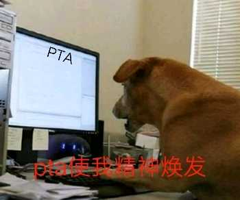

# L1-057 PTA使我精神焕发

## Statement

!!! info "Metadata"
    - 作者: 陈越
    - 单位: 浙江大学
    - 代码长度限制: 16 KB
    - 时间限制: 400 ms
    - 内存限制: 64 MB





以上是湖北经济学院同学的大作。本题就请你用汉语拼音输出这句话。

**输入格式**

本题没有输入。

**输出格式**

在一行中按照样例输出，以惊叹号结尾。

**输入样例**
```plaintext
无
```

**输出样例**
```plaintext
PTA shi3 wo3 jing1 shen2 huan4 fa1 !
```

