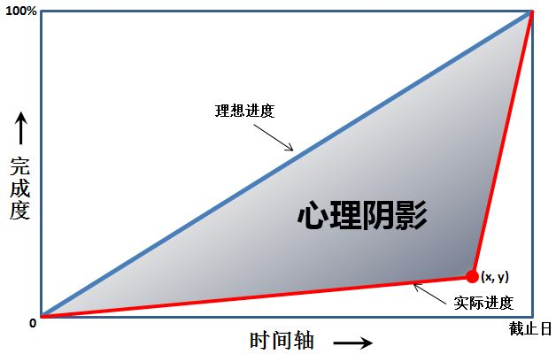

# L1-060 心理阴影面积

## Statement

!!! info "Metadata"
    - 作者: 陈越
    - 单位: 浙江大学
    - 代码长度限制: 16 KB
    - 时间限制: 400 ms
    - 内存限制: 64 MB





这是一幅心理阴影面积图。我们都以为自己可以匀速前进（图中蓝色直线），而拖延症晚期的我们往往执行的是最后时刻的疯狂赶工（图中的红色折线）。由红、蓝线围出的面积，就是我们在做作业时的心理阴影面积。

现给出红色拐点的坐标 $(x,y)$，要求你算出这个心理阴影面积。

**输入格式**

输入在一行中给出 2 个不超过 100 的正整数 $x$ 和 $y$，并且保证有 $x>y$。这里假设横、纵坐标的最大值（即截止日和最终完成度）都是 100。

**输出格式**

在一行中输出心理阴影面积。

友情提醒：三角形的面积 = 底边长 x 高 / 2；矩形面积 = 底边长 x 高。嫑想得太复杂，这是一道 5 分考减法的题……

**输入样例**
```plaintext
90 10
```

**输出样例**
```plaintext
4000
```

