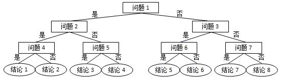

# L1-071 前世档案

## Statement

!!! info "Metadata"
    - 作者: 陈越
    - 单位: 浙江大学
    - 代码长度限制: 16 KB
    - 时间限制: 400 ms
    - 内存限制: 64 MB


网络世界中时常会遇到这类滑稽的算命小程序，实现原理很简单，随便设计几个问题，根据玩家对每个问题的回答选择一条判断树中的路径（如下图所示），结论就是路径终点对应的那个结点。





现在我们把结论从左到右顺序编号，编号从 1 开始。这里假设回答都是简单的“是”或“否”，又假设回答“是”对应向左的路径，回答“否”对应向右的路径。给定玩家的一系列回答，请你返回其得到的结论的编号。

**输入格式**

输入第一行给出两个正整数：$N$（$\le 30$）为玩家做一次测试要回答的问题数量；$M$（$\le 100$）为玩家人数。

随后 $M$ 行，每行顺次给出玩家的 $N$ 个回答。这里用 `y` 代表“是”，用 `n` 代表“否”。

**输出格式**

对每个玩家，在一行中输出其对应的结论的编号。

**输入样例**
```plaintext
3 4
yny
nyy
nyn
yyn
```

**输出样例**
```plaintext
3
5
6
2
```

