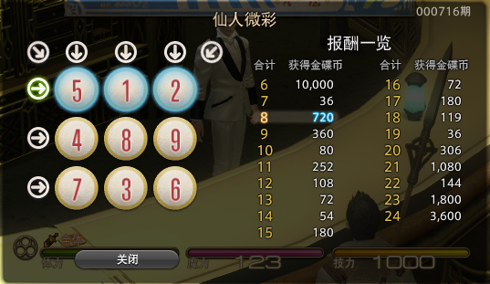

# L1-072 刮刮彩票

## Statement

!!! info "Metadata"
    - 作者: DAI, Longao
    - 单位: 杭州百腾教育科技有限公司
    - 代码长度限制: 16 KB
    - 时间限制: 400 ms
    - 内存限制: 64 MB

“刮刮彩票”是一款网络游戏里面的一个小游戏。如图所示：



每次游戏玩家会拿到一张彩票，上面会有 9 个数字，分别为数字 1 到数字 9，数字各不重复，并以 $3\times3$ 的“九宫格”形式排布在彩票上。

在游戏开始时能看见一个位置上的数字，其他位置上的数字均不可见。你可以选择三个位置的数字刮开，这样玩家就能看见四个位置上的数字了。最后玩家再从 3 横、3 竖、2 斜共 8 个方向中挑选一个方向，方向上三个数字的和可根据下列表格进行兑奖，获得对应数额的金币。


| 数字合计 | 获得金币 | 数字合计 | 获得金币 |
| -------- | -------- | -------- | -------- |
| 6     | 10,000     | 16     | 72     |
| 7     | 36     | 17     | 180     |
| 8     | 720     | 18     | 119     |
| 9     | 360     | 19     | 36     |
| 10     | 80     | 20     | 306     |
| 11    | 252     | 21     | 1,080     |
| 12    | 108     | 22    | 144     |
| 13    | 72     | 23    | 1,800     |
| 14    | 54     | 24    | 3,600     |
| 15    | 180     |      ||      |


现在请你写出一个模拟程序，模拟玩家的游戏过程。

**输入格式**

输入第一部分给出一张合法的彩票，即用 3 行 3 列给出 0 至 9 的数字。**0 表示的是这个位置上的数字初始时就能看见了**，而不是彩票上的数字为 0。

第二部给出玩家刮开的三个位置，分为三行，每行按格式 `x y` 给出玩家刮开的位置的行号和列号（题目中定义左上角的位置为第 1 行、第 1 列。）。数据保证玩家不会重复刮开已刮开的数字。

最后一部分给出玩家选择的方向，即一个整数： 1 至 3 表示选择横向的第一行、第二行、第三行，4 至 6 表示纵向的第一列、第二列、第三列，7、8分别表示左上到右下的主对角线和右上到左下的副对角线。

**输出格式**

对于每一个刮开的操作，在一行中输出玩家能看到的数字。最后对于选择的方向，在一行中输出玩家获得的金币数量。

**输入样例**

```plaintext
1 2 3
4 5 6
7 8 0
1 1
2 2
2 3
7
```

**输出样例**

```plaintext
1
5
6
180
```

