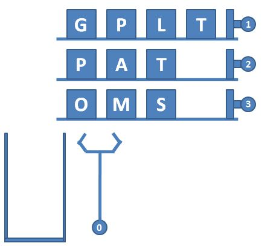
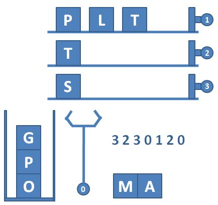

# L2-037 包装机

## Statement

!!! info "Metadata"
    - 作者: 陈越
    - 单位: 浙江大学
    - 代码长度限制: 16 KB
    - 时间限制: 400 ms
    - 内存限制: 64 MB

一种自动包装机的结构如图 1 所示。首先机器中有 $N$ 条轨道，放置了一些物品。轨道下面有一个筐。当某条轨道的按钮被按下时，活塞向左推动，将轨道尽头的一件物品推落筐中。当 0 号按钮被按下时，机械手将抓取筐顶部的一件物品，放到流水线上。图 2 显示了顺序按下按钮 3、2、3、0、1、2、0 后包装机的状态。




图1 自动包装机的结构



图 2 顺序按下按钮 3、2、3、0、1、2、0 后包装机的状态

一种特殊情况是，因为筐的容量是有限的，当筐已经满了，但仍然有某条轨道的按钮被按下时，系统应强制启动 0 号键，先从筐里抓出一件物品，再将对应轨道的物品推落。此外，如果轨道已经空了，再按对应的按钮不会发生任何事；同样的，如果筐是空的，按 0 号按钮也不会发生任何事。

现给定一系列按钮操作，请你依次列出流水线上的物品。

**输入格式**

输入第一行给出 3 个正整数 $N$（$\le 100$）、$M$（$\le 1000$）和 $S_{max}$（$\le 100$），分别为轨道的条数（于是轨道从 1 到 $N$ 编号）、每条轨道初始放置的物品数量、以及筐的最大容量。随后 $N$ 行，每行给出 $M$ 个英文大写字母，表示每条轨道的初始物品摆放。

最后一行给出一系列数字，顺序对应被按下的按钮编号，直到 $-1$ 标志输入结束，这个数字不要处理。数字间以空格分隔。题目保证至少会取出一件物品放在流水线上。

**输出格式**

在一行中顺序输出流水线上的物品，不得有任何空格。

**输入样例**
```plaintext
3 4 4
GPLT
PATA
OMSA
3 2 3 0 1 2 0 2 2 0 -1
```

**输出样例**
```plaintext
MATA
```

