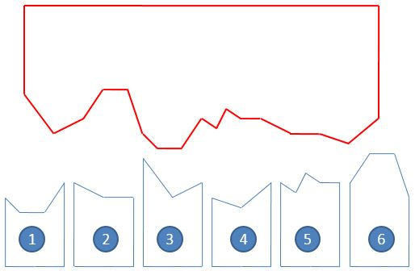
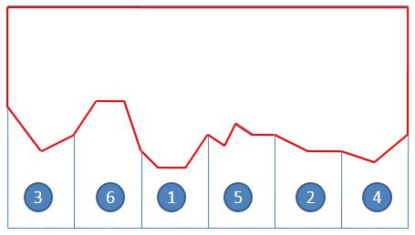

# L3-029 还原文件

## Statement

!!! info "Metadata"
    - 作者: 陈越
    - 单位: 浙江大学
    - 代码长度限制: 16 KB
    - 时间限制: 200 ms
    - 内存限制: 64 MB

一份重要文件被撕成两半，其中一半还被送进了碎纸机。我们将碎纸机里找到的纸条进行编号，如图 1 所示。然后根据断口的折线形状跟没有切碎的半张纸进行匹配，最后还原成图 2 的样子。要求你输出还原后纸条的正确拼接顺序。



图1 纸条编号



图2 还原结果

**输入格式**

输入首先在第一行中给出一个正整数 $N$（$1 < N \le 10^5$），为没有切碎的半张纸上断口折线角点的个数；随后一行给出从左到右 $N$ 个折线角点的高度值（均为不超过 100 的非负整数）。

随后一行给出一个正整数 $M$（$\le 100$），为碎纸机里的纸条数量。接下去有 $M$ 行，其中第 $i$ 行给出编号为 $i$（$1\le i \le M$）的纸条的断口信息，格式为：

```
K h[1] h[2] ... h[K]
```

其中 `K` 是断口折线角点的个数（不超过 $10^4 +1$），后面是从左到右 `K` 个折线角点的高度值。为简单起见，这个“高度”跟没有切碎的半张纸上断口折线角点的高度是一致的。


**输出格式**

在一行中输出还原后纸条的正确拼接顺序。纸条编号间以一个空格分隔，行首尾不得有多余空格。

题目数据保证存在唯一解。

**输入样例**
```plaintext
17
95 70 80 97 97 68 58 58 80 72 88 81 81 68 68 60 80
6
4 68 58 58 80
3 81 68 68
3 95 70 80
3 68 60 80
5 80 72 88 81 81
4 80 97 97 68
```

**输出样例**
```plaintext
3 6 1 5 2 4
```

