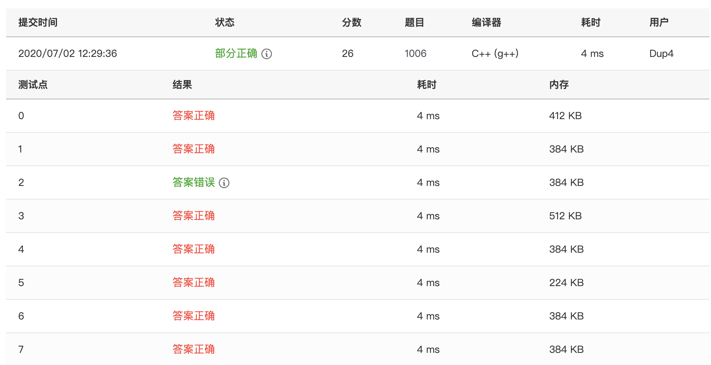
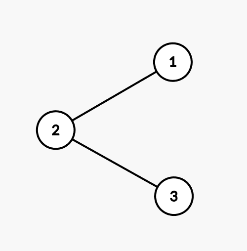
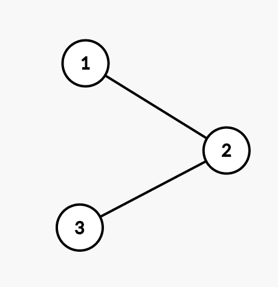

题意：

给出一棵二叉树的中序、前序、后序遍历的残缺序列，问能否唯一的还原出这棵树，如果能，输出中序、前序、后序遍历结果以及层次遍历结果。

结点个数 $n (1 \leq n \leq 10^2)$。

思路：

- 判断在三个遍历序列中均为出现的点的个数是否大于 $1$，如果大于 $1$, 那么肯定 `Impossible`，因为这些点的位置肯定可以互换。
- 我们考虑从中序遍历入手，通过枚举当前子树的中序遍历区间中的根，然后以此分成左右两个子树往下遍历判断合法性。

但是在下面代码中，我认为存在一个问题，就是在枚举根的过程中，我们一旦发现一个合法的根就返回 `True`，这样是有问题的。

因为可能往下去枚举存在另一个合法的根，那么当前子树的遍历序列就存在多种合法状态，最后构成的树就不是唯一的。

因为多加一个判断，判断当前子序列的合法的根的个数，如果大于 $1$ 个，应该也是`Impossible`。

但是加上后 `WA` 了一个点。



举个例子：

```plain
3
- - -
1 2 3
3 2 1
```

它显然存在至少两种状态：

<div style="display:flex; flex-direction:row; justify-content:center;">





</div>

但是下面这份 `AC` 代码，输出的是有结果的。

替换成注释里的内容后的那份 `WA` 的代码，输出是 `Impossible`。
