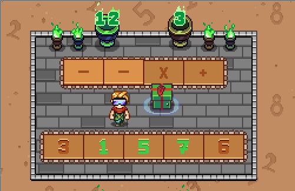

# 1031 Path to Infinity

## Statement

!!! info "Metadata"
    - 作者: W. Caizhi; D. Longao
    - 单位: 杭州百腾教育科技有限公司
    - 代码长度限制: 16 KB
    - 时间限制: 2000 ms
    - 内存限制: 64 MB

*Path to Infinity* is a never-ending math mini-game in the RPG Secrets of Grindea. In this mini-game, players are faced with a set of $n$ pressure plates marked with digits from 0 to 9, another set of $(n-1)$ pressure plates marked with operators '+' (addition), '-' (subtraction) or '\*' (multiplication) and a target number $m$ shown in the flame of the green torch on the right. To proceed through this level, players have to step on the pressure plates in the correct order to form an expression whose value is exactly the same with the target number. All the pressure plates must be used exactly once.



Note that in this mini-game, all the operators have the same priority and expression is calculated from left to right. For example, expression $1 + 2 * 2$ will be figured out as $6$, not $5$.

You are now presented with one level of such mini-game. How many different expressions can you build from the given digits and operators so that the value of the expression is exactly $m$?

Two expressions are considered different if there exists an integer $i$ such that $1 \le i \le n$ and the $i$-th operand in the two expressions are different, or if there exists an integer $j$ such that $1 \le j < n$ and the $j$-th operator in the two expressions are different.

**Input Specification**

There is only one test case. The first line of the input contains two integers $n$ and $m$ ($2 \le n \le 10$, $-10^9 \le m \le 10^9$), indicating the number of digit pressure plates and the target number.

The second line of the input contains two strings $s$ and $t$ ($|s| = n$, $|t| = n - 1$) separated by a space. String $s$ will only contain digits from 0 to 9, where the $i$-th digit represents the digit marked on the $i$-th digit pressure plate. String $t$ will only contain operators '+', '-' and '\*', where the $i$-th operator represents the operator marked on the $i$-th operator pressure plate.

**Output Specification**

Output two lines. The first line contains an integer indicating the number of different expressions built from the given digits and operators so that its value is exactly $m$. The second line contains a string without spaces indicating the desired expression with the smallest lexicographic order. Characters in the expressions are compared by their ASCII code.

If one cannot build any desired expression, print "Impossible" on the second line instead.

**Sample Input 1**

```plaintext
10 12
3321001233 +++---***
```

**Sample Output 1**

```plaintext
424007
0*0*1+2+2+3-1*3-3-3
```

**Sample Input 2**

```plaintext
3 2
111 **
```

**Sample Output 2**

```plaintext
0
Impossible
```

